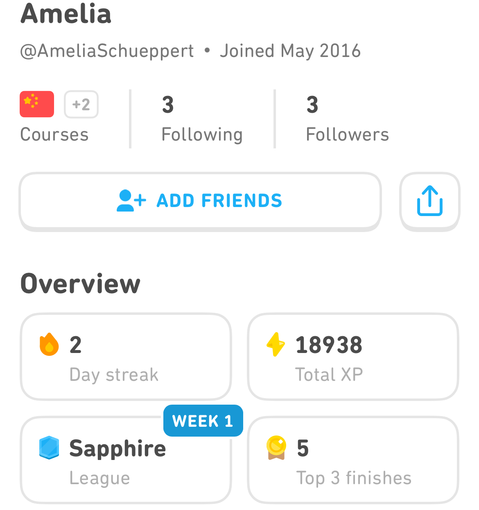

# Assignment 2: Divergent Design

## Broad Application Goals
Name: MoodBoard \
Audience: New college students looking to connect with peers and build meaningful communities without the distractions of traditional social media. \
Value: MoodBoard offers a focused, community-driven platform that helps users discover and engage with new people and groups through intentional, purposeful interactions. By eliminating endless scrolling, focusing content on interaction-specific wants, and promoting easy ways to share collaboratively share and plan experiences and events, MoodBoard prioritizes real connections and emotional well-being.

## Scrapbook of Comparables

### Pinterest Trending

 Pinterest lets users browse through categories of posts. MoodBoard could replicate this by allowing users to select specific categories to browse through when they open the app, minimizing mindless scrolling and maximizing focused engagement.

### Instagram Location Tagging
{ style="display: block; margin: 0 auto;" width="500"}
Instagram users can add location tags to their posts. MoodBoard could use similar tags for posts, allowing users to tag where the event or photo took place. MoodBoard could use these locations to allow users to browse location specific posts and allow people to brainstorm campus locations to hold events

### Spotify Collaborative Playlist
{style="display: block; margin: 0 auto;" width="500"}
Spotify allows users to create playlists with friends. MoodBoard could use a similar concept to enable collaborative posts, where multiple users upload photos and content to a shared post for a campus event or project.

### Shared Photo Albums
{width="500"  style="display: block; margin: 0 auto;"}
Photos allows people to share albums and contribute photos together. MoodBoard could adopt a similar approach to collaborative posts where multiple users contribute photos, captions, and event details to a single post

### Slack Reaction Emojis
{width="500"  style="display: block; margin: 0 auto;"}
Slack allows users to react to specific messages with emojis. MoodBoard could implement reactions to posts so users can express their feelings about an event or activity with minimal effort. It could also give insight into how people are engaging with the content.

### Photos - Explore Map
{width="500"  style="display: block; margin: 0 auto;"}
Photos has a interactive map that lets users view photos based on location. MoodBoard could implement a map feature where users can explore posts based on where they were created on campus, helping students discover new places.

### Netflix Recommendation Feedback
{width="500"  style="display: block; margin: 0 auto;"}
Netflix allows users to provide feedback on recommendations from the app. The feedback allows Netflix to streamline recommendations to an individual users interests. Moodboard could implement a similar method of feedback where user could indicate if a post interested them allowing them the app to make better suggestions. 

### Partiful RSVP System
{width="500"  style="display: block; margin: 0 auto;"}
Partiful lets users RSVP to events, showing how many people plan to attend. MoodBoard could use a similar system to allow students to RSVP to campus events directly from the app, making it easy to gauge interest and participation.

### Duolingo Steaks
{width="500"  style="display: block; margin: 0 auto;"}
Duolingo keeps users engaged by rewarding streaks and milestones. MoodBoard could introduce a similar gamification feature where users earn badges for attending events or creating collaborative posts, motivating them to stay active on the platform.

## Brainstorming Feature Ideas
1. **Tag Location**: Users can add location tags to posts by typing it in or using GPS data. These tags would allow MoodBoard to categorize posts geographically (e.g., "library" or "kresge lawn"), providing users with information about where events took place. These tags could also allow users to browse posts by location allowing them to see events that were hosted in a specific location to help them plan their own events for that location.  

2. **Tag Post Type**: Users select a post type (e.g., "study session," "campus event") when posting. This classification will help organize and filter content for others. When users are looking to browse a specific type of content on the app. These tags would help the app recommend posts that match that interest. 

3. **Collaborative Posts**: Multiple users can collaborate on a post by uploading their own images and captions. This feature makes it easier for groups of people to share their experiences from activities and events and prevents multiple identical or similar posts of the same content from different people. 

4. **Category Feed**: Users can filter their feed based on categories (e.g., "music events," "study tips") to focus on specific types of content rather than scrolling aimlessly. This feature encourages people to use the app intentionally with an interest-specific goal. It also increases user's access to posts that align with their interests when using the app.

5. **Recommendation Feedback**: Users can provide feedback on whether a post aligns with the category it was placed in, allowing the app to improve its categorization over time. Users will able to upvote or downvote a post, indicating if it aligns with the category. This feedback will only be used internally and will not be visible to other users. 

6. **Save Types**: Users can save posts into different folders or "boards," like Pinterest, to keep track of events, activities, or content they’re interested in. These board would help users plan event and activities based on what others have previously done and posted.

7. **Board Nesting**: Users can organize their saved boards hierarchically, like folders within folders, to easily manage and access related content (e.g., "Social Events > Party Ideas"). This system would make it easier for users to organize their ideas and plan better activities and events 

8. **Privately Label Friend Types**: Users can label their friends with custom tags (e.g., "study buddy," "roommate") for better organization and to prioritize posts from these groups in certain feeds. These labels would help the app promote more relevant content, decreasing the amount of time needed to spend scrolling. 

9. **Captions for Each Image in Post**: Users can post multiple images in a single post with the option to add individual captions These captions would allow users to provide more context to different parts of posts, increasing the usefulness of the post to other users. 

10. **Label Post Collaborator**s: The app will visibly label all collaborators in a joint post, so it’s clear who contributed, making group projects and shared events more transparent.

11. **Post Viewer Options**: Users can select different privacy settings for collaborative posts (e.g., "only visible to collaborators" or "followers of any collaborator can see this post").

12. **Category Change Prompts**: After viewing a specific category for a certain time, the app prompts the user to switch categories, encouraging a broader experience and avoiding content burnout. This feature helps users pursue new interests.

13. **Add Private Friends**: Users can friend people they know in real life and choose whether their friend list is visible or private. Private friends can post collaboratively or keep posts visible only to one another.

14. **Follow Public Accounts**: Users can follow interest-based accounts (clubs, sports teams, etc.) to stay updated on campus happenings and discover new communities. 

15. **Event Integration**: Sync the app with campus calendars so users get event notifications and relevant posts for upcoming campus activities. Users are able to to post events and collect RSVPs on the app to allow events to reach large audience. 

16. **Custom Post Themes**: Users can design and reuse post templates, like "Campus Hangout" or "Study Session," to maintain consistency in how they share content across different events. These templates make it easier to post events faster increasing the ease at which people can share events. 

17. **Mood-Based Categories**: Users can select a mood for their posts (e.g., "energetic," "relaxed") or search for posts by mood, offering a new way to connect with content based on how they’re feeling. This feature allows user to choose to look at content that is less specific to a certain theme but fits a more general mood

18. **Interactive Campus Maps**: Posts can be linked to an interactive campus map, allowing users to see posts from specific locations on campus, encouraging them to explore new areas. This feature helps users explore new places and plan event locations.

19. **Time-Limited Posts**: Posts can be set to expire after a certain time (e.g., "visible for 48 hours"), creating urgency and encouraging quick engagement with the content. This time limitation ensures that events are visible when they are most relevant to users. 

20. **Post Tags for Interests**: Users can tag other people's posts with specific interests (e.g., "photography," "food," "sports"), helping others discover content based on common hobbies or passions. These tags make it easier for people to reach content that interests them. 

** Chat-GPT assisted with brainstorming some feature ideas

## VSD analysis

### Stakeholders: Non-targeted Use (Prompt 4)
* Observation: MoodBoard could be used for purposes outside its intended scope, such as spreading misinformation or organizing inappropriate gatherings. This might be especially problematic with the app’s collaborative features. \\
* Design Response: Implement content moderation and reporting mechanisms, where users can flag posts or events that violate guidelines. Introduce AI-driven content filters to detect harmful or inappropriate use of the app, ensuring the platform remains aligned with its original goals.

### Time: The Long Now (Prompt 4)
* Observation: Over decades, MoodBoard could evolve alongside users. A 50-year-old who has used the app since college might have different needs. For example they might want to use it to maintain long-term friendships or organize alumni events.
* Design Response: Introduce features that allow for evolving use over time. Enable users to archive their past events and collaborations, keeping the app up to date with current interests. Allow users to update the relationships with people (for example separably labeling friends that they are still in close contact with vs those who they only keep up to date with through interacting on the app)

### Pervasiveness: Widespread Use (Prompt 4)
* Observation: As MoodBoard grows from small-scale use to widespread use, new social dynamics might emerge. For example, the app could become a status symbol, where the number of collaborative posts or followers becomes competitive, leading to exclusion.
* Design Response: Create features that prioritize meaningful connections over metrics like follower counts. Allow people hide number of followers and likes to reduce competition. Only show number of people attending event once a user RSVPs. 

### Values: Inclusivity and Fairness (Prompt 1)
* Observation: MoodBoard aims to be inclusive, but there could be barriers to entry for students who are less tech-savvy, socially anxious, or uncomfortable with public sharing. They might feel excluded from events or conversations happening on the app.
* Design Response: Offer alternative ways to engage (such as anonymously following/RSVPing to events) and allow more private interactions. Additionally, make sure the app is accessible to those with disabilities by including features like text-to-speech, closed captioning, and colorblind-friendly interfaces.

### Stakeholders: One Person, Multiple Roles (Prompt 3)
* Observation: A student using MoodBoard may act as both a direct and indirect stakeholder. For example, they might be a content creator (direct) and a viewer of other posts (indirect), or they could be part of an organization promoting events while also participating in personal social activities.
* Design Response: Allow users to toggle between different roles (e.g., personal, organization, or academic). Each role can have separate feeds and privacy settings, helping users manage their interactions and content differently based on their current activity.
 
## Storyboarding and sketching

### Story 1: Posting Concert
{style=" display: block; margin: 0 auto;" width="1000" }

### Story 2: Attending Soccer Event
{style=" display: block; margin: 0 auto;" width="1000" }

### Story 3: Planning Concert
{style=" display: block; margin: 0 auto;" width="1000" }
