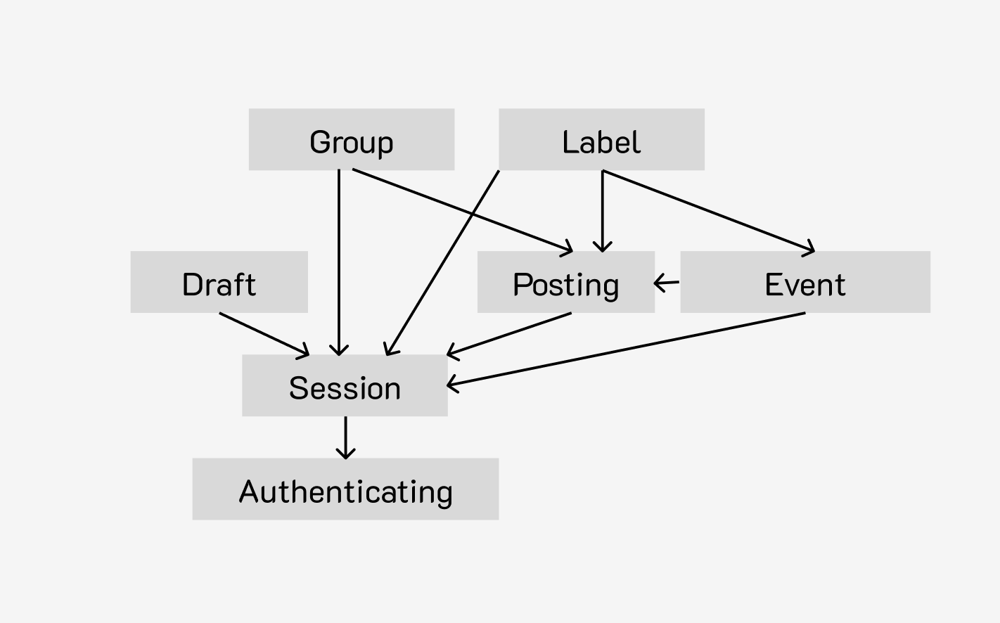

# Assignment 3
MoodBoard is an innovative social app designed to help new college students connect meaningfully with their peers and communities while avoiding the pitfalls of mindless scrolling. Its design focuses on collaboration, personalization, and intentional social interaction.

One of the app’s key features is its label system, which allows users to categorize and filter content based on specific themes. Users can apply labels to posts, enabling them to discover content that aligns with their interests. This feature creates a highly personalized feed where users can engage with content relevant to their preferences. By filtering posts through labels, MoodBoard ensures that the content students see is tailored to their needs, enhancing the overall user experience.

Collaboration is central to MoodBoard. The app allows users to create drafts of content and invite others to contribute, refining and selecting what gets published. This collaborative drafting system is ideal for group projects, event planning, or co-creating posts with friends. Once the content is finalized, the group can collectively approve and share it with the wider community. This feature promotes teamwork and makes sharing content a more meaningful process.

MoodBoard also offers users a flexible way to manage their relationships. Students can create and organize groups such as "Friends" and "Following" to control whose content appears in their feed. This feature allows for more intentional engagement by giving users the power to curate their social interactions and prioritize connections based on personal relationships.

Additionally, users can RSVP to events through the app’s group system, making it easy to stay connected to campus activities and plan for both in-person and online events. Secure session management ensures a seamless and protected user experience.
MoodBoard is a social app that fosters collaboration, personalization, and intentionality, providing students with a unique and engaging way to build meaningful connections.

## MoodBoard Concepts

### Concept: Draft [Item]

**Purpose**: Allow groups of people to create and collaborate on drafts of content.

**Operational Principle**: Once a draft is created using `createDraft(m, out d)`, members can be added with `addMember(u, m, d)`. Users added to the draft can contribute content via `addContent(m, d, c)` and select items for inclusion using `selectContent(m, d, c)`. Selected items can be deselected using `deselectContent(m, d, c)`. Finally, the content can be retrieved for review or publishing using `getContent(d, out cs)`.

**State**:
- `drafts`: set Draft
- `members`: drafts -> set User
- `contents`: drafts -> set Item
- `selected`: drafts -> set Item

**Actions**:

    createDraft(m: User, out d: Draft):
        d.members += m
        drafts += d

    addMember(u: User, m: User, d: Draft):
        u in d.members
        m not in d.members
        d.members += m

    addContent(m: User, d: Draft, c: Item):
        m in d.members:
        d.contents += c

    selectContent(m: User, d: Draft, c: Item):
        m in d.members
        c in d.contents:
        d.selected += c

    deselectContent(m: User, d: Draft, c: Item):
        m in d.members
        c in d.selected:
        d.selected -= c

    getContent(d: Draft, out cs: set Item):
        cs = d.selected

    

---

### Concept: Post [Item]

**Purpose**: Share approved content with other users.

**Operational Principle**: Once the draft is ready, a post can be created using `createPost(u, ms, c, out d)` Approval from the necessary users is managed via `approvePost(m, d)`, and only when all approvers have approved can the post be made public with `post(m, d)`. Once post is posted it can be deleted using `deletePost(m,d)`. Before a post is deleted but after being posted, you can find all posts by a user m using `getPostbyUser(m:user)`

**State**:
- `posts`: set Post
- `approvers`: posts -> set User
- `approved`: posts -> set User
- `content`: posts -> set Item
- `attendees`: posts -> set User

**Actions**:

    createPost(u: User, ms: set User, c: set Item, out d: Post,):
        u in ms
        d.approvers = ms
        d.event=e
        d.content = c

    approvePost(m: User, d: Post):
        m in d.approvers:
        d.approved += m

    post(m: User, d: Post):
        d.approved == d.approvers:
        posts += d
    getApprovers( d: Post, ms: set User):
        ms= d.approvers 

    deletePost(m: User, d: Post):
        d in posts
        m in d.approvers
        posts-=d

    getPostbyUser(m:user, out ds:set Post)
        for post in posts
            if m in post.approvers:
                ds+=post
        
    
### Concept: Event [Item]
**Purpose**: Allow posts to be events that other users can RSVP to 
**Operational Principle**: An event can be created using `createEvent(u, ms, c, out d)`. Once created attendees can add themselves using `addAttendee(u,e)`.

**State**:
- `events`: set Event
- `hosts`: events -> set User
- `attendees`: events -> set User
- `content`: events -> one Item

**Actions**:

    createEvent(u:User, hs: set User, c: Item, out e: Event):
        u in hs
        e.hosts=hs
        e.content=c
        evenst+=event
        
    addAttendee(a:User,e:Event):
        e in events
        e.attendees+=a

    getEventbyHost(m:user, out ds:set Event)
        for event in events
            if m in event.hosts:
                ds+=event

    

---

### Concept: Session [User]

**Purpose**: Enable authenticated actions for an extended period of time.

**Operational Principle**: Once a user starts a session using `start(u, out s)`, they remain authenticated for the session's duration. The current user can be retrieved using `getUser(s, out u)`. To end the session and remove access, `end(s)` is called.

**State**:
- `active`: set Session
- `user`: active -> one User

**Actions**:

    start(u: User, out s: Session):
        s.user = u
        active += s

    getUser(s: Session, out u: User):
        s in active:
        u = s.user

    end(s: Session):
        active -= s

---

### Concept: Authenticating [User]

**Purpose**: Manage user registration and login.

**Operational Principle**: Users can register with `register(name, pass, out u)` to gain access to the system. They can log in using `authenticate(name, pass)` to verify their credentials, ensuring that only authenticated users can access other functionality.

**State**:
- `registered`: set User
- `username`: registered -> one String
- `password`: registered -> one String

**Actions**:

    register(name: String, pass: String, out u: User):
        u not in registered
        u.username = name
        u.password = pass
        registered += u

    authenticate(name: String, pass: String):
        for u in registered:
            if u.username == name and u.password == pass:
                return u

---

### Concept: Label [Item]

**Purpose**: Filter content based on labeled themes.

**Operational Principle**: Users can create a label via `createLabel(s, out l)` and then use `addLabel(u, p, l)` to associate content with it, allowing for easy categorization and filtering of posts. To retrieve all items with a given label, use `getItems(l, out ps)`.

**State**:
- `labels`: set Label

- const `names`: set String
- `name`: labels -> one String
- `items`: labels -> set Item
- `label_allowed`: (Item: set User)

**Actions**:

    createLabel(s: String, out l: Label):
        s in names
        l.name = s
        labels += l

    getLabel(s:String):
        s in names
        for label in labels:
            if label.name=s
                l=label

    addLabel(u: User, p: Item, l: label):
        if u in label_allowed[p]:
            l.items += p

    getItems(l: Label, out ps: set Item):
        ps = l.items

    addLabeler(u:User,p:Item):
        label_allowed[p]+=u

    filterByLabel(ps: set Item, l:label, out lps):
        for p in ps:
            if p in l.items:
                lps+=p

---

### Concept: Group [Item]

**Purpose**: Allow users to save content to groups, events to RSVP list, and users as friends and followers

**Operational Principle**: Users create groups via `createGroup(u, s, out g)` and then add items (users or posts) using `addItem(u, p, g)`. Items saved to a group can be retrieved via `getItems(g, out ps)`

**State**:
- `groups`: set Group
- `user_groups`: (User: set Group)
- `name`: groups -> one String
- `user`: groups -> one User
- `items`: groups -> set Item

**Actions**:

    createGroup(u: User, s: String, out g: Group):
        g.name = s
        g.user = u
        user_groups[u] += g

    addItem(u: User, p: Item, g: Group):
        if u == g.user:
            g.items += p

    getItems(g: Group, out ps: set Item):
        ps = g.items

---

## Dependency

## Synchronization  

1. **User Registration and Authentication:**
    - **Sync register(username: String, password: String, out user: User, out session: Session):**
        - **Purpose**: Register a new user and automatically initiate a session.
        - **Actions**: 
            - `Authenticating.register(username, password, out user)` to create the user account.
            - `Sessioning.start(user, out session)` to start an authenticated session for the user.
            - `Group.createGroup(user, "Yes", out RSVPyesGroup)`,`Group.createGroup(user, "No", out RSVPnoGroup)`,`Group.createGroup(user, "Maybe", out RSVPmaybeGroup)` to initialize RSVP-related groups.
            - `Group.createGroup(user, "Friends", out friendGroup)` and `Group.createGroup(user, "Following", out followinGroup)` to initialize user relationship categories.

2. **Login and Session Management:**
    - **Sync login(username: String, password: String, out user: User, out session: Session):**
        - **Purpose**: Authenticate user and start a session.
        - **Actions**: 
            - `Authenticating.authenticate(username, password, out user)` to verify credentials.
            - `Sessioning.start(user, out session)` to begin the session.

    - **Sync logout(session: Session):**
        - **Purpose**: Terminate the session and log out the user.
        - **Action**: `Sessioning.end(session)` to end the session.

3. **Draft Creation and Management:**
    - **Sync createDraft(session: Session, content: Content):**
        - **Purpose**: Create a draft for collaborative content development.
        - **Actions**: 
            - `Sessioning.getUser(session, out user)` to identify the user.
            - `Draft.createDraft(user, out draft)` to start a new draft.
            
    - **Sync addDraftMembers(session: Session, draft: Draft, members: set[User]):**
        - **Purpose**: Add members to collaborate on the draft.
        - **Actions**: 
            - `Sessioning.getUser(session, out user)` to authenticate.
            - `Draft.addMembers(user, members, draft)` to allow collaboration.

    - **Sync addDraftContent(session: Session, draft: Draft, content: Content):**
        - **Purpose**: Add content to the draft.
        - **Actions**: 
            - `Sessioning.getUser(session, out user)` for authentication.
            - `Draft.addContent(user, draft, content)` to update the draft with new material.

4. **Pos/Event Creation and Approval:**
    - **Sync createPost(session: Session, draft: Draft):**
        - **Purpose**: Convert the draft into a post after review.
        - **Actions**: 
            - `Sessioning.getUser(session, out user)` to verify the session.
            - `Draft.getContent(draft, out content)` to retrieve the finalized content.
            - `Post.createPost(user, members, False, content)` to create a new post for approval.
    - **Sync createEvent(session: Session, draft: Draft):**
        - **Purpose**: Convert the draft into a post after review.
        - **Actions**: 
            - `Sessioning.getUser(session, out user)` to verify the session.
            - `Draft.getContent(draft, out content)` to retrieve the finalized content.
            - `Post.createPost(user, members, True, content)` to create a new event for approval.

    - **Sync approvePost(session: Session, post: Post):**
        - **Purpose**: Approve content for publishing.
        - **Action**: 
            - `Sessioning.getUser(session, out user)` to verify the session.
            -`Post.approvePost(user, post)` to mark the post as approved.

    - **Sync post(session:Session,post:Post):**
        - **Purpose**: Publish content
        - **Action**:
            -- `Sessioning.getUser(session, out user)` to verify the session. 
            - `Post.post(user, post)` to add post to published posts
            - `Post.getApprovers(post, out members)` to get post approvers
            - for user in members `Label.addLabeler(user, post)` to allow posters to label

    - **Sync createEvent(session:Session, post:Post):**
        - **Purpose**: Create event from post
        - **Action**: 
            - `Sessioning.getUser(session, out user)` to verify the session.
            - `Post.getApprovers(post, out members)` to get post approvers
            - `Event.createEvent(user,members,post)` to create an event hosted by approvers
            - `Posts.deletePost(user,post)` to delete post that is now an event
            - for user in members `Label.addLabeler(user, event)` to allow hosts to label

    - **Sync labelPost(session: Session, label: String, post: Post):**
        - **Purpose**: Assign a thematic label to the post.
        - **Actions**: 
            - `Sessioning.getUser(session, out user)` to verify the session.
            - `Label.getLabel(label, out labelObject)` to retrieve the label.
            - `Label.addLabel(user, post, labelObject)` to categorize the post.
    
        
5. **Saving and Managing Content:**
    - **Sync savePost(session: Session, post: Post, group: String):**
        - **Purpose**: Save a post to a user-defined group.
        - **Actions**: 
            -- `Sessioning.getUser(session, out user)` to verify the session.
            - `Group.getGroup(user, group, out groupObject)` to find the target group.
            - `Group.addItem(user, post, groupObject)` to save the post.

    - **Sync rsvpEvent(session: Session, event: Event, response: String):**
        - **Purpose**: Respond to event invites via RSVP (Yes, No, Maybe).
        - **Actions**: 
            -- `Sessioning.getUser(session, out user)` to verify the session.
            - `Group.getGroup(user, response, out group)` to get the appropriate RSVP group.
            - `Group.addItem(user, event, group)` to RSVP to the event.
            - if response == "Yes" `Event.addAttendee(user, event)`

6. **Managing Relationships:**
    - **Sync addFriend(session: Session, friend: User):**
        - **Purpose**: Add another user to the "Friends" group.
        - **Actions**: 
            -- `Sessioning.getUser(session, out user)` to verify the session.
            - `Group.getGroup(user, "Friends", out user_friendsRel)` to access the user's friend list.
            - `Group.getGroup(friend, "Friends", out f_friendsRel)` to access the friend's friend list.
            - `Group.addItem(user, friend, user_friendsRel)` to add the friend to the user's list.
            - `Group.addItem(friend, user, f_friendsRel)` to add the user to the friend's list.

    - **Sync followUser(session: Session, targetUser: User):**
        - **Purpose**: Follow another user.
        - **Actions**: 
            -- `Sessioning.getUser(session, out user)` to verify the session.
            - `Group.getGroup(user, "Following", out followingRel)` to access the following list.
            - `Group.addItem(user, targetUser, followingRel)` to add the user to the "Following" list.

7. To improve the `getFeed` method in the provided specification, we'll clarify the feed generation process, ensuring that it efficiently retrieves and filters content by both label and user relationships (friends and followed users). Here's the adjusted version of **Sync getFeed**:

### 7. **Content Feed and Filtering:**
   - **Sync getFeed(session: Session, label: String, out feed: set[Post, Event]):**
       - **Purpose**: Generate the user's content feed filtered by a specific label, with content from friends and followed users.
       - **Actions**:
           1. **Session Verification**:  
              - `Sessioning.getUser(session, out user)` to verify the session and retrieve the user object.
              
           2. **Retrieve Label-Tagged Content**:  
              - `Label.getLabel(label, out labelObject)` to find the specified label object.

              
           3. **Retrieve Friends' and Followed Users' Posts**:  
              - `Group.getItems(user, "Friends", out friends)` to retrieve the user's friends.
              - `Group.getItems(user, "Following", out following)` to retrieve the users the user is following.
              
              - For each friend or followed user:
                - `Post.getPostsbyUser(friend, out friendPosts)` and `Event.getEventsbyHost(friend, out friendEvents)` to retrieve their posts and events.
                - Filter `friendPosts` and `friendEvents` by label, ensuring only labeled content is included: `Label.filterByLabel(friendPosts, labelObject, out filteredFriendPosts)` and `Label.filterByLabel(friendEvents, labelObject, out filteredFriendEvents)`.
              
           4. **Merge and Sort Feed**:  
              - Combine `labeledPosts`, `filteredFriendPosts`, and `filteredFriendEvents` into the final feed:  
                `feed = labeledPosts.union(filteredFriendPosts).union(filteredFriendEvents)`.
              - Optionally sort the `feed` based on creation time or relevance.

## Wireframing

[WireFrame Link](https://www.figma.com/design/BII96rDiUQLY15GppnvldD/moodBoard?node-id=1-2&t=gxxmihWY4KwDrD6U-1)

### Example Pages (for full wireframe click above link)
|  |  |  |
|------------------------------|------------------------------|------------------------------|
|  |  |  |

## Design Tradeoffs

1. **Label Customization vs. Simplicity**
   - **Options**: Allow users to create fully custom labels, or limit labels to a predefined set of categories.
   - **Rationale**: I opted for predefined categories to ensure consistency across the app and avoid label overload, which could complicate navigation. This design supports clarity in filtering posts and reduces the cognitive load on users, while still offering flexibility with a reasonable number of categories.

2. **Post Approval Process: Full Consensus vs. Majority Rule**
   - **Options**: Require all members of a group to approve content before posting or allow majority approval.
   - **Rationale**: I chose full consensus for content approval to foster collaboration and prevent conflicts over post visibility. This decision ensures that all members feel equally represented and reduces the likelihood of unapproved content being posted, which aligns with the app's focus on thoughtful sharing rather than impulsive posting.

3. **Opening Page: Limited Options vs. Free Search**
   - **Options**: Display a set of predefined theme labels for users to choose from when opening the app, or allow users to search for any theme label freely.
   - **Rationale**: I decided to combine both approaches by offering a few recommended theme labels along with a free search option. This ensures that users can quickly access popular or curated themes, promoting ease of use for those who want immediate suggestions. At the same time, providing the ability to search for any label allows for flexibility and personalization, empowering users to find content that aligns more specifically with their interests and goals. This balance between guidance and freedom enhances the overall user experience.
