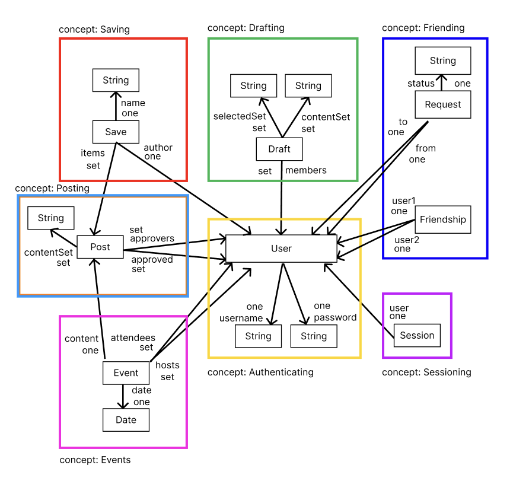

# Assignment 4

## Abstract Data Model

### Concept: Draft [Item]

**Purpose**: Allow groups of people to create and collaborate on drafts of content.

**Operational Principle**: Once a draft is created using `createDraft(m, out d)`, members can be added with `addMember(u, m, d)`. Users added to the draft can contribute content via `addContent(m, d, c)` and select items for inclusion using `selectContent(m, d, c)`. Selected items can be deselected using `deselectContent(m, d, c)`. Finally, the content can be retrieved for review or publishing using `getContent(d, out cs)` and the members using `getMembers(d,out ms)`. If not `delete(d)`, then `getDrafts(out ds: set Draft)` will include d. 

**State**:
- `drafts`: set Draft
- `members`: drafts -> set User
- `contentSet`: drafts -> set Item
- `selectedSet`: drafts -> set Item

**Actions**:

    create(m: User, c: Item, out d: Draft):
        d.members += m
        d.contentSet+=c
        drafts += d

    getDrafts(out ds: set Draft):
        ds=drafts

    getByMember(m:User out ds: set Draft):
        for draft in drafts
            if m in draft.members
                ds+=draft

    addMember( m: User, d: Draft):
        d in drafts
        m not in d.members
        d.members += m

    addContent(m: User, d: Draft, c: Item):
        d in drafts
        c not in d.content
        m in d.members:
        d.contentSet += c

    select(m: User, d: Draft, c: Item):
        d in drafts
        m in d.members
        c in d.contentSet:
        c not in d.selectedSet;
        d.selectedSet += c

    deselectContent(m: User, d: Draft, c: Item):
        m in d.members
        c in d.selected:
        d.selected -= c

    getContent(d: Draft, out cs: set Item):
        d in drafts
        cs = d.selected
    getMembers(d:draft,out ms: set User):
        ms=d.members
    getContent(d: Draft, out cs: set Item):
        d in drafts
        cs = d.selected
    delete(d:draft):
        drafts-=d
    

---

### Concept: Post [Item]

**Purpose**: Share approved content with other users.

**Operational Principle**: Once the draft is ready, a post can be created using `createPost(u, ms, c, out d)` Approval from the necessary users is managed via `approvePost(m, d)`, and only when all approvers have approved can the post be made public with `post(m, d)`. Once post is posted it can be deleted using `deletePost(m,d)`. Before a post is deleted but after being posted, you can find all posts by a user m using `getPostbyUser(m:user)`

**State**:
- `posts`: set Post
- `approvers`: posts -> set User
- `approved`: posts -> set User
- `content`: posts -> set Item

**Actions**:

    create(u: User, ms: set User, c: set Item, out d: Post,):
        u in ms
        d.approvers = ms
        d.content = c

    getPosts(out ds: set Post):
        ds=posts

    getByAuthor(u:User, out ps: set Post):
        for p in posts
            if u in p.approvers:
                ps+=p

    approvePost(m: User, d: Post):
        m in d.approvers:
        d.approved += m

    post(m: User, d: Post):
        d.approved == d.approvers:
        posts += d

    getApprovers( d: Post, ms: set User):
        ms= d.approvers 

    delete(m: User, d: Post):
        d in posts
        m in d.approvers
        posts-=d

    
### Concept: Event [Item]
**Purpose**: Allow posts to be events that other users can RSVP to 
**Operational Principle**: An event can be created using `createEvent(u, ms, c, out d)`. Once created attendees can add themselves using `addAttendee(u,e)`.

**State**:
- `events`: set Event
- `hosts`: events -> set User
- `attendees`: events -> set User
- `content`: events -> one Item
- `date`: events -> one String

**Actions**:

    createEvent(u:User, hs: set User, c: Item, d:String, out e: Event):
        u in hs
        e.hosts=hs
        e.content=c
        e.date=d
        events+=event
        
    addAttendee(a:User,e:Event):
        e in events
        e.attendees+=a

    getEventByHost(m:user, out ds:set Event)
        for event in events
            if m in event.hosts:
                ds+=event

    
---

### Concept: Sessioning [User]

**Purpose**: Enable authenticated actions for an extended period of time.

**Operational Principle**: Once a user starts a session using `start(u, out s)`, they remain authenticated for the session's duration. The current user can be retrieved using `getUser(s, out u)`. To end the session and remove access, `end(s)` is called.

**State**:
- `active`: set Session
- `user`: active -> one User

**Actions**:

    start(u: User, out s: Session):
        s.user = u
        active += s

    getUser(s: Session, out u: User):
        s in active:
        u = s.user

    end(s: Session):
        active -= s

---

### Concept: Authenticating [User]

**Purpose**: Manage user registration and login.

**Operational Principle**: Users can register with `register(name, pass, out u)` to gain access to the system. They can log in using `authenticate(name, pass)` to verify their credentials, ensuring that only authenticated users can access other functionality.

**State**:
- `users`: set User
- `username`: registered -> one String
- `password`: registered -> one String

**Actions**:

    register(name: String, pass: String, out u: User):
        u not in registered
        u.username = name
        u.password = pass
        registered += u

    authenticate(name: String, pass: String):
        for u in registered:
            if u.username == name and u.password == pass:
                return u

---

### Concept: Saving [Item]

**Purpose**: Allow users to save content to names groups

**Operational Principle**: Users create groups via `createGroup(u, s, out g)` and then add items using `save(g,i)`. Once saved, g in set returned by `getSaved()` or `getByAuthor(u)`. Can get specific save by user u under name s using `getSave(u,s)`. 

**State**:
- `saved`: set Save
- `name`: saved -> one String
- `user`: saved -> one User
- `items`: saved -> set Item

**Actions**:

    create(u: User, s: String, out g: Save):
        g.name = s
        g.user = u
        user_groups[u] += g

    save(g:Save,i:item):
        g in saved
        g not in items
        g.items+=i

    getSaved(out gs:set Save):
        gs=saved
    
    getByAuthor(u:user,out gs:set Save):
        for save in saved
            if save.user=u:
                gs+==save
    
    
    getSave(u:user,s:name, out g: Save):
        for save in saved
            if save.name=s and save.user=u:
                g=save
    
        
### Concept: Friendship [Item]
**Purpose**: Allow users to view eachothers content 

**Operational Principle**: After `sendRequest(f,t)`, request appear in set returned by `getRequests(u)` and t can either `acceptRequest(f,t)`, `rejectRequest(f,t)` . If accept, then f in set returned by `getFriends(t)`
**State**:
- `friends`: set Friendship
- `requests`: set Request
- `user1`: friends -> one User
- `user2`: friends -> one User
- `to`: requests -> one User
- `from`: requests -> one User
- `status`: requests -> one String

**Actions**:

    getRequests(u: User, our rs: set Request):
        for r in requests:
            if r.to==u or r.from==u:
                rs+=r
    sendRequest(f:User,t:user, our r: Request):
        r.to=t
        r.from=f
        r.status="pending"

    acceptRequest(f:User,t:user)
        r.to=t
        r.from=f
        r.status="accepted"
        removePendingRequest(f,t)
        addFriend(f,t)

    rejectRequest(f:User,t:user)
        r.to=t
        r.from=f
        r.status="rejected"
        removePendingRequest(f,t)

    removeFriend(u:User, f:User):
        for friend in friends:
            if friend.user1==u and friend.user2==f or friend.user2==u and friend.user1==f :
                f=friend
        f-=friend

    getFriends(u:User, out fs:set User)
        for friend in friends:
            if friend.user1==u
                fs+=friend.user2
            if friend.user2==u
                fs+=friend.user1
    addFriend(u1:User,u2:User, out f: Friendship)
        f.user1=u1
        f.user2=u2
    removePendingRequest(f:User,t:User)
        for request in requests
            if request.from=f and request.to=t and status="pending":
                r=request
        request-=r
## State Diagram
